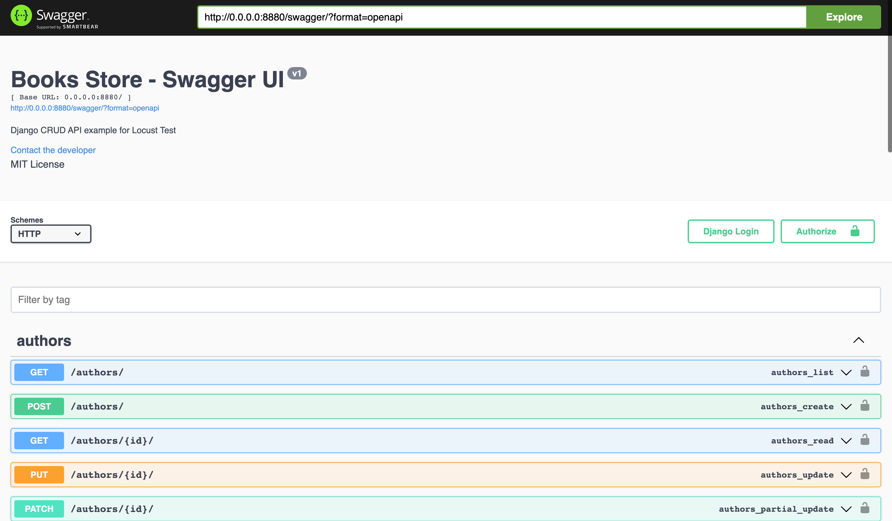
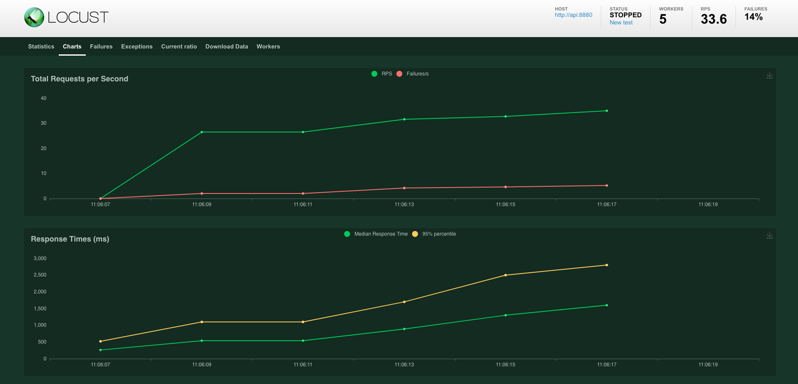
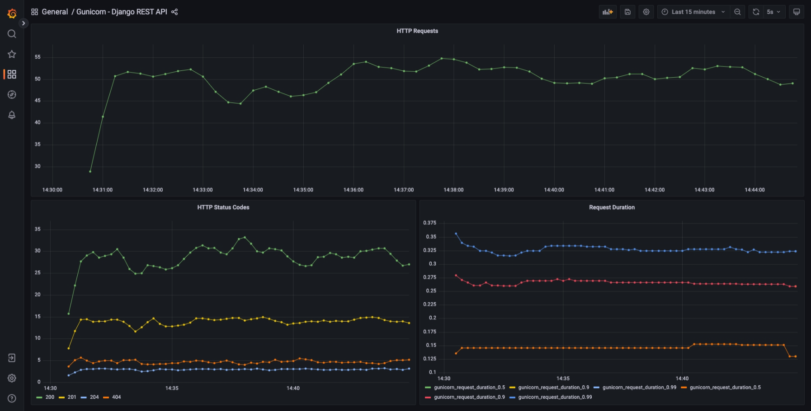
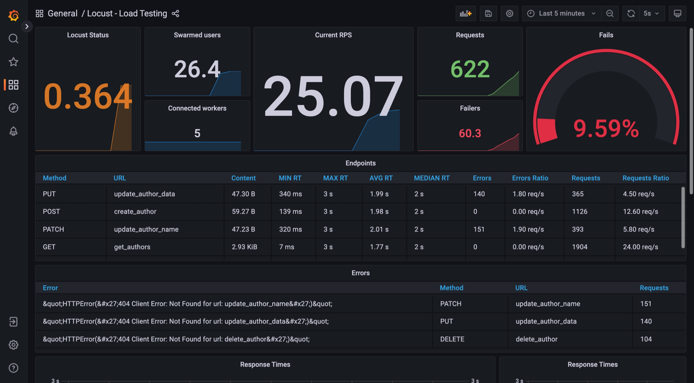

# Locust distributed load test running on Kubernetes 

A complete ecosystem runing in Kubernetes, to show how to use Locust to do distributed load tests.

### Running

#### Docker compose

```shell
$ docker compose up --build -d
```

#### Kubernetes

Comming soon. See [#4](https://github.com/jjpaulo2/locust-kubernetes-distributed/issues/4).

## Accessing

#### Django RESTful API

- http://0.0.0.0:8880/swagger - Django CRUD API Swagger
- http://0.0.0.0:8880/admin - Django admin for CRUD API (user `admin` / pass `123`)

#### Locust UI

- http://0.0.0.0:8881/ - Locust Master Front-end

#### Grafana

- http://0.0.0.0:8886/ - Grafana

#### Prometheus / exporters

- http://0.0.0.0:8883/metrics - Metrics from Locust server
- http://0.0.0.0:8884/metrics - Metrics from Django API Gunicorn server
- http://0.0.0.0:8885/graph - Prometheus front-end

## Screenshots

#### Django RESTful API Swagger UI



#### Locust UI



#### Grafana Gunicorn Dashboard



#### Grafana Locust Dashboard


